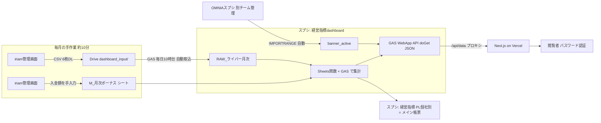

# 00. システム全景 — cozoru経営ダッシュボード

> 最終更新: 2026-06 ／ この資料の正はこのリポジトリ。仕様を変えるPRでは関連する資料も同時に更新すること。

## このシステムは何か

uyet社グループ3事務所（**cozoru / ライブナウV / Tolance**）のIRIAMライバー事業の経営KPIを自動集計するシステム。

- **目的**: 月次の経営数値集計を「手作業数時間/月」から「CSV投入10分/月」に圧縮する
- **見る人**: uyet経営陣・現場（阿部様）。閲覧は https://cozoru-dashboard.vercel.app （社内パスワード認証）
- **数字の正**: iriamからの入金額（請求書税込）。本システムの売上はこれと一致する（端数±数十円は端数処理）

## 全体構成



ポイントは2つ。

1. **取込はGAS、集計はSheets関数**という設計。集計ロジックの大半はスプシの数式（SUMIFS等）にあり、GASは「CSV→RAW書込」「帳票の再構築」「APIでのJSON配信」を担う
2. **バナイベ（バナーイベント）だけ別系統**。OMNIAスプシからIMPORTRANGEで自動連携され、月次の手作業はない

## 構成要素一覧

| 層 | 実体 | 場所 / ID | オーナー |
|---|---|---|---|
| フロント | Next.js 16 + React 19 | github.com/COZORU/cozoru-dashboard（private） | COZORU org |
| ホスティング | Vercel（main push で自動デプロイ） | プロジェクト: cozoru-s-projects | info@cozoru.com |
| API + 取込 | Google Apps Script（このリポジトリ `gas/` がミラー） | scriptId `1Ci20w_cUzW-PGyJ1nvY5EaHBI0Z8fnHzM_HFXS7PfBmTFIFuuRg5AxYk` | info@cozoru.com |
| データスプシ | 経営指標dashboard（RAW・マスタ・banner_active・GASバインド先） | `1175R2Ow8Wr8GBk8bYzuWBQQ49zhmDp26sHF6PKwFGn0` | info@cozoru.com |
| 帳票スプシ | 経営指標（PL個社別 = クライアントが見るメイン帳票） | `1Bn8f2Gq2rhRluuapMm8r0lOoTy0YnrQC8rdWn6U8csM` | info@cozoru.com |
| バナイベ元データ | OMNIAスプシ（banner_active の IMPORTRANGE 元） | IDは banner_active シートの IMPORTRANGE 式参照 | OMNIA管理チーム |
| CSV投入口 | Drive フォルダ `dashboard_input/`（処理済みは archive へ自動移動） | 経営指標dashboard と同じDrive | info@cozoru.com |
| 旧版スプシ | 旧Zeronity版（参照用・更新停止） | `1e7Lk3ZwcYrcXaFhXQmnnK-xIIrWo8nJAFz_FCgF85Ts` | Zeronity |

## アカウントと権限

- **info@cozoru.com がスプシ・GAS・Vercel すべてのオーナー**（2026-05に移管済み）。引き継ぎ後の開発は cozoru ドメイン内で完結できる
- GAS の Webアプリ再デプロイは**スクリプトオーナーと同一ドメインのアカウントのみ可能**（claspの仕様）。これまで実装者（藤野・別ドメイン）はコード反映まで行い、再デプロイだけ owner 操作だった。**引き継ぎ後はこの制約自体が消える**
- 引き継ぎ時に付与すべき権限の一覧 → [07_handover_checklist.md](07_handover_checklist.md)

## 関係者

| 役割 | 名前 | 備考 |
|---|---|---|
| クライアント代表 | uyet 梶田大樹様 | |
| 現場運用 | uyet 阿部様 | 月次CSV投入・数値確認の実務 |
| 仲介 | Zeronity 加藤様 | |
| 進行 | 神田様 | 定例MTG主催 |
| 実装（引き継ぎ元） | 藤野（Zeronity） | 引き継ぎ後も一定期間は質問対応可（07参照） |

## この資料の歩き方

| やりたいこと | 読む資料 |
|---|---|
| まず全体を掴む | この資料 |
| 画面（Next.js）を直す・ローカルで動かす | [01_frontend.md](01_frontend.md) |
| API・取込・集計ロジック（GAS）を直す | [02_gas.md](02_gas.md) |
| スプシの構造・どのシートが何かを知る | [03_spreadsheets.md](03_spreadsheets.md) |
| 毎月の運用をやる | [04_operations.md](04_operations.md) |
| 何かおかしい・数字が合わない | [05_troubleshooting.md](05_troubleshooting.md) |
| 用語・KPIの意味（ダイヤボーナスとは等） | [06_glossary.md](06_glossary.md) ＋ [PL_FIELD_DEFINITIONS.md](PL_FIELD_DEFINITIONS.md) |
| 引き継ぎ作業そのもの | [07_handover_checklist.md](07_handover_checklist.md) |

## リポジトリ構成

```
cozoru-dashboard/
├── app/                  … Next.js App Router（ページ・APIプロキシ・認証）
├── components/           … UI部品（banner/ = バナイベ実績タブ一式）
├── gas/                  … GASソースのミラー（編集の起点。詳細: gas/README.md）
├── tools/                … バナイベ集計のテスト・検証スクリプト（Node.js）
└── docs/handover/        … この引き継ぎ資料一式
```
